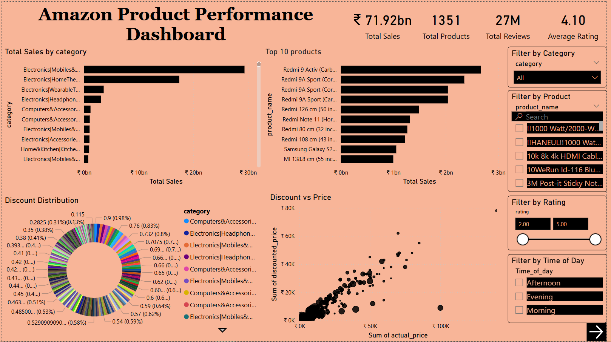
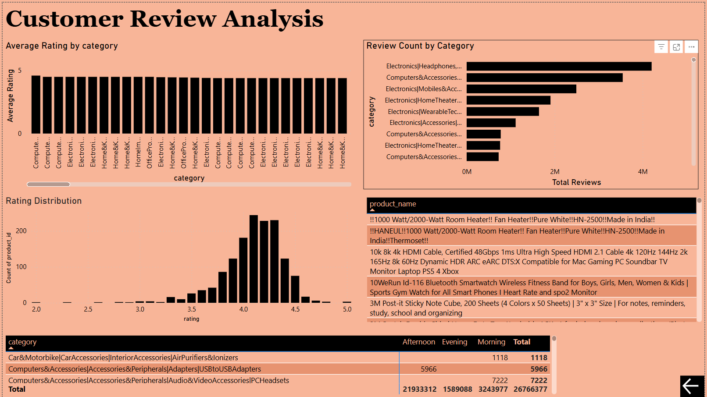

# Amazon Product Performance Dashboard (Power BI)

This project analyzes Amazon product performance using Power BI.  
The dashboard provides insights into product sales, pricing strategies, discounts, and customer reviews.

---

## Dashboard Preview

### Page 1: Product Performance

---

### Page 2: Customer Review Analysis

---

## Key Insights

• Electronics and mobile products dominate sales.  
• Higher discounts drive higher review counts.  
• Most products maintain ratings above 4.0.  
• Certain categories generate significantly more customer engagement.

---

## Tools Used

Power BI  
Data Visualization  
DAX Measures  
Data Cleaning  

---

## Dataset Source
https://www.kaggle.com/datasets/karkavelrajaj/amazon-sales-dataset
Amazon Sales Dataset from Kaggle
